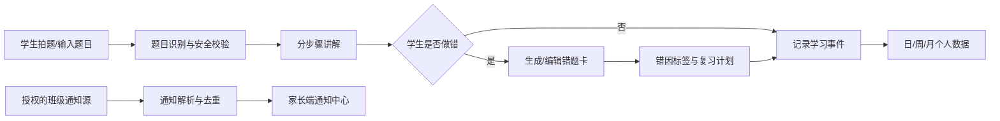

# PRD-001：中小学生学习助手

| 字段 | 内容 |
| --- | --- |
| 当前版本 | v0.1.0（草案） |
| 创建日期 | 2026-07-12 |
| 产品阶段 | MVP |
| 目标用户 | 中国大陆中小学生、家长；教师/学校仅作为后续合作方 |
| 开发依据 | 本文为首版产品、设计、研发与测试的共同基线 |

## 1. 产品定位

面向中国中小学生的学习辅助 App。通过“作业讲解—错因归纳—错题复习—学习数据反馈”的闭环，帮助学生理解题目、减少重复出错；同时将经授权获取的班级通知汇总并转发给家长，降低信息遗漏。

产品不替代教师教学、不承诺答案绝对正确，也不以采集、监控或排名学生为目的。

## 2. MVP 目标与成功标准

### 2.1 业务目标

1. 学生可提交一道作业题并获得分步骤、适龄的讲解。
2. 学生或家长可将错误题目沉淀为可检索、可复习的错题本。
3. 家长可查看已授权班级通知和学生自身按日、周、月的学习概览。
4. 在学生、家长明确同意的前提下，可展示**匿名、同意参与**的班级学习聚合对比。

### 2.2 MVP 验收指标（上线后观察）

- 题目提交至首次结果展示的 P95 时长不高于 15 秒（网络和人工审核异常除外）。
- 已提交错题中，成功生成“错因 + 复习建议”的比例不低于 90%。
- 已连接且授权的通知源中，通知卡片可查看、可标记已读、可转发到家长端。
- 学习数据统计与底层事件记录一致；日/周/月边界统一采用 Asia/Shanghai 时区。

## 3. 用户、角色与权限

| 角色 | 主要动作 | 数据边界 |
| --- | --- | --- |
| 学生 | 提交题目、查看讲解、维护错题、完成复习、查看个人学习数据 | 仅本人数据；未获授权不得查看其他同学的可识别数据 |
| 家长/监护人 | 绑定学生、查看/管理学生数据、配置通知、接收提醒、管理授权 | 仅已验证绑定的未成年子女数据 |
| 班级管理员（后续） | 管理官方通知源、查看匿名聚合 | 不可导出或查看个体学生学习明细 |
| 平台运营 | 处理举报、内容安全与系统运维 | 最小权限、全程审计 |

学生首次使用必须完成监护人同意与账号绑定；未完成前仅可浏览演示内容，不得上传题目图片、连接通知源或参与班级对比。

## 4. 核心用户流程

## 5. 功能需求

### F-01 作业题目提交与讲解（P0）

**入口**：首页“讲解作业”；支持拍照、相册图片和文字输入。MVP 优先支持小学/初中数学，语文与英语仅在题目识别质量达标后开启。

**规则**：

1. 上传前展示隐私提示，提醒遮挡姓名、班级、联系方式等无关信息；服务端检测到明显个人信息时提示用户裁剪或确认。
2. 系统识别题干、学科、年级（可由用户修正）、题型和答案区域；识别失败时允许手工输入，不得捏造题干。
3. 讲解必须包含：题目复述、解题思路、逐步过程、答案/结论、易错点、一道同类型练习（可关闭）。
4. 讲解语言应符合所选学段，默认先给思路再显示完整答案；用户可点击展开答案。
5. 对不确定、图像模糊、超出支持范围或安全风险内容，明确说明限制并提供重拍/求助老师建议，不输出貌似确定的错误结论。
6. 用户可评价“有帮助/无帮助”、纠正学科或题干，并可将题目保存为错题。

**验收**：一张清晰的支持范围内数学题图片可被提交；结果页显示上述五项内容；用户可编辑识别文本、保存错题和提交反馈。

### F-02 错题本与错因分析（P0）

**数据字段**：原题图片（可选）、标准化题干、学科、年级、知识点、题型、用户答案（可选）、正确答案、讲解、错因标签、创建时间、掌握状态、复习记录。

**规则**：

1. 错因由模型建议，学生/家长可修改；首版标签至少包括：概念不清、审题失误、计算失误、方法不熟、粗心、不会做、其他。
2. 按学科、知识点、错因、日期、掌握状态筛选；支持关键词检索题干。
3. 错题默认状态为“待复习”。完成一次复习后，学生选择“仍不会/有点会/已掌握”；系统记录事件并据此安排下一次复习提醒。
4. 不自动删除错题；家长可按单题或全部删除，并同时删除关联图片和分析数据。
5. 同一题目可提示疑似重复，是否合并由用户决定。

**验收**：保存后的错题可在 2 秒内出现在列表；筛选条件组合正确；一次复习会更新状态、记录时间并影响学习统计。

### F-03 班级通知收集与家长转发（P0，但接入方式受限）

**目标**：收集班级官方通知并让家长及时收到，不读取或分析与通知无关的群聊内容。

**允许的 MVP 接入方式（按优先级）**：

1. 学校/教师提供的官方系统、开放 API、导出的通知文件或专用转发邮箱；
2. 家长主动在 App 内粘贴通知文本、上传通知截图，或通过受支持的系统分享能力导入；
3. 获得平台官方授权后接入的企业微信/微信生态能力。

**明确不做**：不使用模拟点击、外挂、协议逆向、爬虫或未经平台许可的“机器人”登录个人微信并读取班级群消息；不得在后台读取私人聊天记录。

**规则**：

1. 每个通知源须由家长完成授权，明确来源、读取范围、有效期、停止方式；保存授权记录。
2. 系统仅提取通知标题、正文、发布时间、截止时间、附件/原链接、来源；对导入文本进行通知识别与去重，允许用户修订。
3. 通知按“待处理/已读/已过期”展示，可设置提醒时间和标记重要。
4. “转发给家长微信”使用合规渠道：应用内推送为默认；微信服务通知、订阅消息或分享卡片仅在具备对应官方能力和用户订阅时启用。不可承诺向个人微信自动发消息。
5. 每条通知应标识来源和导入时间；AI 摘要必须可展开原文，不能代替原文。

**验收**：家长可手工导入一条通知，系统完成去重、状态管理、截止时间提醒和应用内推送；未接入官方能力时，微信入口只展示“分享/订阅指引”，不执行自动私信。

### F-04 学习记录与日/周/月数据（P0）

**记录事件**：题目提交、讲解完成、错题新增、复习开始/完成、掌握度更新、学习时长（仅前台有效学习时段）。

**个人看板**：

- 日：学习时长、讲解题数、错题新增数、复习完成数、掌握度变化；
- 周/月：上述指标趋势、学科/知识点分布、主要错因、待复习数量；
- 数据可按学生本人或家长绑定学生切换；缺失数据展示为“无记录”，不补零造假。

**计算规则**：

1. 学习时长从有效学习动作开始计时；连续 5 分钟无交互暂停，切到后台立即暂停，单次有效时长上限 60 分钟。
2. 周从周一 00:00 开始；月按自然月；全部按 Asia/Shanghai 统计。
3. 掌握度为错题复习自评的聚合指标，页面必须说明其为学习记录指标，不代表考试成绩或能力诊断。

**验收**：同一批测试事件在日、周、月口径下统计可追溯；跨周/月和时区边界结果正确；用户可进入指标说明。

### F-05 班级学习对比（P1，默认关闭）

**目的**：帮助家长和学生了解自身学习节奏，不建立学生排名、公开榜单或竞争性评价。

**规则**：

1. 仅在学校/班级具备合规组织依据、监护人单独同意且班级内有效同意参与人数不少于 10 人时启用。
2. 仅展示匿名聚合区间或分位信息，例如“本周复习完成数处于参与者中位区间”；绝不显示姓名、头像、学号、单个同学记录、可反推个体的极小样本数据或排名。
3. 家长可随时退出；退出后立即停止新增采集，历史数据按隐私政策处理并从后续聚合中排除。
4. 仅采集完成本产品内学习活动产生的记录；不采集设备监控、定位、通讯录或其他 App 使用行为。

**验收**：未满足开关条件时，对比模块不可用；满足条件后仅输出匿名聚合；任一成员退出会正确影响后续样本量与展示。

### F-06 账号、家长绑定与设置（P0）

1. 支持手机号或合规第三方账号登录；未成年人账号须经监护人验证与同意。
2. 学生档案最少包含昵称、学段、年级；真实姓名、学校和班级均为非必填，除非接入官方班级服务确有必要。
3. 家长通过一次性绑定码或受控邀请绑定学生；学生和家长均可解除绑定，解除前须二次确认。
4. 设置页提供数据导出、账户注销、单项授权管理、通知频率和未成年人隐私政策入口。

## 6. 页面清单

| 页面 | 主要内容 | 关键动作 |
| --- | --- | --- |
| 首次引导与监护人同意 | 年龄/身份、隐私摘要、授权项 | 同意、退出、绑定 |
| 首页 | 讲解入口、待复习、今日概览、通知摘要 | 拍题、开始复习、查看通知 |
| 题目讲解页 | 题干、分步讲解、易错点、练习、反馈 | 展开答案、保存错题、纠错 |
| 错题本 | 列表、检索、筛选、复习计划 | 查看、复习、编辑、删除 |
| 通知中心 | 通知卡片、来源、截止时间、状态 | 导入、标记、提醒、分享 |
| 学习数据 | 日/周/月切换、趋势、指标说明 | 切换周期/学科、查看明细 |
| 家长中心 | 多学生切换、授权与提醒 | 绑定、管理授权、导出/删除 |
| 设置与隐私 | 权限、数据、注销、政策 | 修改/撤回授权、注销 |

## 7. 非功能与合规要求

1. **未成年人保护**：按适用的中国未成年人网络保护、个人信息保护及生成式 AI 相关要求设计；在上线前完成法务和应用商店合规审查。涉及敏感个人信息、向第三方提供数据、班级聚合和 AI 训练使用，均需单独、明示的监护人同意（如法律要求）。
2. **最小化与目的限定**：不默认采集精确位置、通讯录、相册全量权限、麦克风、设备标识或私人聊天记录。题目图片与通知中的无关个人信息应脱敏或不保存。
3. **安全**：传输使用 TLS；敏感数据加密存储；角色权限校验；导出/删除/授权变更留存审计；生产环境不得使用真实未成年人数据调试。
4. **内容安全与质量**：AI 输出须具备涉未成年人内容安全策略、敏感内容拦截、反馈入口和人工处理机制；对答案不确定性做显式提示。
5. **数据权利**：支持查看、更正、导出、删除个人数据和注销账户。注销流程与数据保留期限需在隐私政策中明确。
6. **性能与可用性**：核心页面首屏目标 3 秒内；弱网下显示加载、重试和本地草稿；服务不可用时保留题目草稿但不得伪造分析结果。

## 8. 数据模型（逻辑实体）

| 实体 | 核心字段 | 关系 |
| --- | --- | --- |
| Account | id、角色、登录标识、状态 | 关联 StudentProfile / GuardianBinding |
| StudentProfile | id、accountId、昵称、学段、年级、监护人同意状态 | 有多个 Question、Mistake、LearningEvent |
| Question | id、学生 id、题干、图片引用、学科、识别状态、讲解版本 | 可生成 Mistake |
| Mistake | id、题目 id、知识点、错因、掌握状态、创建时间 | 有多个 ReviewRecord |
| ReviewRecord | id、错题 id、开始/完成时间、自评、复习结果 | 生成 LearningEvent |
| LearningEvent | id、学生 id、类型、发生时间、时长、关联对象 | 用于统计 |
| NoticeSource | id、学生/家长 id、类型、授权状态、有效期 | 有多个 Notice |
| Notice | id、来源 id、标题、原文、截止时间、去重键、状态 | 可触发 Reminder |
| ConsentRecord | id、主体、用途、版本、时间、撤回时间 | 审计授权 |

## 9. 非目标与后续版本候选

本 MVP 不包含：在线直播课、教师批改、支付/商城、自动代写作业、公开社交、学生排行榜、未经授权的微信个人号机器人、跨校学生画像。

后续候选：更多学科、学校官方系统对接、教师协作入口、家长周报、离线题库、个性化复习算法。进入开发前均须另立需求并完成合规评估。

## 10. 待确认事项

1. 首发学段和学科：是否限定为小学/初中数学？
2. 通知的首发渠道：学校系统、家长手工导入、企业微信，分别有哪些已确认合作或接口？
3. 班级学习对比是否为首发必需；若是，谁是数据处理与班级组织责任主体？
4. AI 讲解使用的模型、成本上限、人工审核与错误申诉服务等级。
5. 账号体系、目标平台（iOS/Android/小程序）和是否需要教师端。

## 11. 版本记录

| 版本 | 日期 | 变更 | 影响 |
| --- | --- | --- | --- |
| v0.1.0 | 2026-07-12 | 创建 MVP 草案，定义作业讲解、错题本、合规通知收集、学习统计和匿名班级对比边界 | 新建 |

