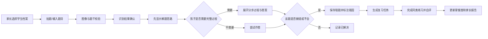
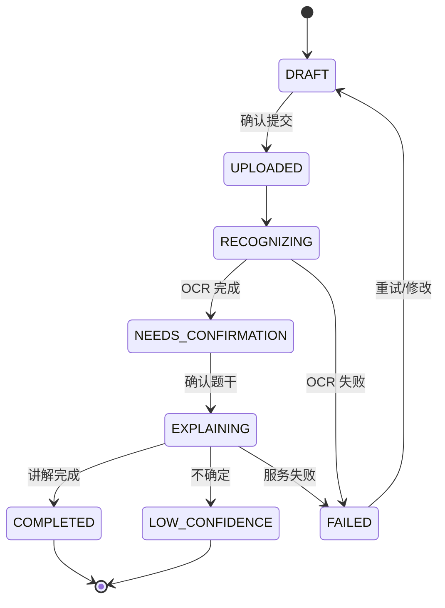

# PRD-002：家长作业讲解与错题本

| 字段 | 内容 |
| --- | --- |
| 当前版本 | v1.0.0 |
| 创建日期 | 2026-07-13 |
| 状态 | 可开发 |
| 优先级 | P0：作业讲解、错题本、复习；P1：学习报告与家长提醒 |
| 目标平台 | iOS / Android App；后端 API |
| 适用范围 | 中国大陆小学 1 年级至初中 3 年级；首发仅支持数学 |
| 关联需求 | 本文替代 PRD-001 的核心学习功能；班级通知、群机器人、同学对比不在本期范围 |

## 1. 产品概述

### 1.1 一句话定义

为家长提供一个“拍题看懂—保存错题—定期复习—看见进步”的学习辅助工具，帮助家长在不替孩子代写作业的前提下，快速解释题目并建立可持续的错题复习习惯。

### 1.2 要解决的问题

| 用户 | 现状痛点 | 本产品解决方式 |
| --- | --- | --- |
| 家长 | 看不懂题、没有时间完整讲解、不知道孩子哪些知识点薄弱 | 拍题得到适龄、分步骤讲解；通过错题和报告掌握重点 |
| 学生 | 遇到不会的题直接要答案；做错后不再复盘 | 默认先展示思路，需主动展开答案；将错题转为练习任务 |
| 家庭 | 错题散落在练习册、相册和聊天记录中，复习没有计划 | 统一归档、自动分类、按掌握度安排复习 |

### 1.3 产品原则

1. **先启发，后答案**：默认展示解题思路和提示，不直接将完整答案置于首屏。
2. **家长辅助而非教师替代**：不提供代写、批量抄答案、考试作弊等能力；不作学习能力或成绩承诺。
3. **孩子可理解**：讲解语言、例题和交互随年级适配，避免成人化长篇推导。
4. **一题一闭环**：每个“做错/不会”的问题均可沉淀为错题、复习和掌握度记录。
5. **最小数据**：只收集完成功能所需的信息；学生真实姓名、学校、班级不是首发必填项。

## 2. 范围与非目标

### 2.1 本期范围

- 家长与学生账号绑定、儿童档案和授权管理；
- 数学题拍照/相册/文字录入、题目识别、分步骤 AI 讲解；
- 家长/学生确认错题、错因标注、错题本检索筛选；
- 复习任务、同类练习、自评掌握度和提醒；
- 个人学习周报/月报及数据明细；
- AI 输出反馈、内容安全、隐私删除与导出。

### 2.2 非目标

- 班级群读取、班级通知收集、同学数据比较、排行榜；
- 教师端、学校管理后台、直播课、人工批改、付费商城；
- 全学科覆盖；语文/英语、口算批改和试卷批改须另立需求；
- 自动完成作业、绕过教师作业要求、生成考试答案；
- 在未成年人设备上进行后台监控、定位、通讯录读取或行为画像。

## 3. 用户、权限与账号关系

### 3.1 角色

| 角色 | 定义 | 主要权限 |
| --- | --- | --- |
| 家长（监护人） | 完成手机号验证并同意儿童隐私规则的成年人 | 创建/绑定儿童、查看全部学习记录、管理提醒、导出/删除数据 |
| 学生 | 与监护人绑定的儿童档案使用者 | 提交题目、查看讲解、完成复习、查看自己的简版进度 |
| 运营审核员 | 经授权处理内容安全或用户反馈的内部人员 | 仅查看处理案件所需的最小数据，所有访问留审计 |

### 3.2 账号与绑定规则

1. 一个家长账号可创建或绑定多个学生档案；一个学生档案可绑定至多 2 个家长账号。
2. 学生可使用“家庭设备模式”（无独立登录）或独立账号；MVP 默认家庭设备模式。
3. 创建学生档案时，家长必须确认监护关系并阅读儿童隐私摘要；需记录政策版本、同意时间和撤回时间。
4. 家长解绑或删除学生档案前，展示影响：错题、题目图片、复习记录和报告均不可恢复；二次确认后进入删除队列。
5. 独立学生账号首次上传内容或查看个人数据前，必须完成已绑定家长的授权校验。

## 4. 核心业务流程



## 5. 功能需求

### F-01 首次引导、登录与儿童档案（P0）

**用户故事**：作为家长，我希望几分钟内完成登录和孩子档案创建，明确知道数据如何使用。

**页面与字段**：

| 页面 | 必填字段 | 可选字段 | 动作 |
| --- | --- | --- | --- |
| 登录 | 手机号、验证码 | — | 登录/注册 |
| 监护人确认 | 勾选确认、隐私政策版本 | — | 同意并继续 / 退出 |
| 创建学生档案 | 昵称、学段、年级 | 头像 | 创建 |
| 首页档案切换 | — | — | 切换/新增/管理学生 |

**规则**：

1. 年级枚举为小学一年级至六年级、初中一年级至三年级；未选择时不可进入拍题。
2. 昵称长度 1–20 个字符；禁止引导填写真实姓名或学校。
3. 登录验证码有效期 5 分钟，同一手机号 60 秒内只能请求一次；连续失败应触发风险控制提示。
4. 政策未同意、账户冻结或档案删除处理中，禁止提交题目。

**验收**：新家长从登录至创建档案不超过 4 个页面；重启 App 后可恢复上次选定档案；非法年级/空昵称有明确错误提示。

### F-02 题目提交与识别（P0）

**用户故事**：作为家长或学生，我希望快速拍下孩子不会的数学题，系统准确识别后允许我纠正文字。

**入口**：首页主按钮“讲解一道题”；支持相机拍照、相册选择、文字输入。

**输入约束**：

| 输入 | 约束 | 失败处理 |
| --- | --- | --- |
| 图片 | JPG/PNG/HEIC；单张不超过 10 MB；一次 1 题 | 提示裁剪、重拍或改用文字输入 |
| 文字 | 1–2,000 字符；支持数学符号和换行 | 为空/超长时禁止提交 |
| 年级 | 默认学生档案年级，可编辑 | 仅本次生效，不改档案 |
| 学科 | 首发固定数学 | 不提供其他学科入口 |

**处理规则**：

1. 客户端在上传前提示避免拍入姓名、学号、电话号码、整页学生信息；支持裁剪和旋转。
2. 服务端创建 `Question`，状态依次为 `UPLOADED`、`RECOGNIZING`、`NEEDS_CONFIRMATION`、`EXPLAINING`、`COMPLETED` 或 `FAILED`。
3. OCR 结果必须在确认页展示，用户可以逐字符编辑；用户修改后以编辑结果为准。
4. 系统应识别多题、模糊、非数学、无法识别和疑似试卷整页；多题时要求裁剪为一题，不能擅自选择其中一题。
5. 原图默认仅用于本题识别、讲解和错题展示；用户可在保存错题时选择保留或仅保留文本题干。
6. 网络中断时保留本地草稿，恢复网络后需用户确认再上传。

**验收**：清晰的支持范围内题目可进入确认页；用户编辑后讲解基于新题干；失败状态可重试并不重复创建题目；无网络时不丢失草稿。

### F-03 AI 作业讲解（P0）

**用户故事**：作为家长，我希望看到可靠、孩子听得懂的讲解；作为学生，我想先获得提示，而非被直接给出答案。

**结果页固定结构**：

1. 题目与年级标签；
2. “先想一想”：1–3 条关键提示，默认展开；
3. 解题思路：说明选择何种方法及原因；
4. 分步过程：每步一个编号，可逐步展开；
5. 最终答案：默认折叠，用户点击“查看答案”后显示；
6. 易错点：不超过 3 条、具体到本题；
7. 同类练习：1 道难度相近、数字或情境变化的题；
8. 底部操作：做错了、我会了、重新识别、反馈。

**生成规则**：

1. 系统提示词必须携带学段、年级、学科、已确认题干、题型和语言风格约束；不得将原图的无关个人信息送入后续生成链路。
2. 讲解须使用中文；小学阶段避免代数化表达，初中阶段可按教材常用方法解释。
3. 模型无法确定题干或答案时，返回 `LOW_CONFIDENCE`，显示“这道题我不够确定，建议核对题干或询问老师”，不得生成确定口吻的完整答案。
4. 对“只要答案”“帮我写作业”等意图，仍仅提供思路、过程和学习提示，不模拟学生交作业。
5. 同类练习必须由独立校验流程检查可解性、难度和答案一致性；校验失败则不展示练习。
6. 用户可对题干、答案、讲解和难度分别提交“有问题”反馈，并填写说明；反馈保留关联的模型版本和请求版本。

**讲解服务输出契约**：

```json
{
  "status": "COMPLETED | LOW_CONFIDENCE | FAILED",
  "question": "确认后的题干",
  "grade": "小学三年级",
  "knowledgePoints": ["两位数乘法"],
  "hints": ["先把 24 看成 20 和 4"],
  "strategy": "把一个因数拆分后分别相乘再相加",
  "steps": [{"order": 1, "content": "..."}],
  "answer": "96",
  "commonMistakes": ["漏乘个位"],
  "practice": {"question": "...", "answer": "..."},
  "modelVersion": "string"
}
```

**验收**：结果页默认不显示完整答案；每个完整结果都有题干、提示、思路、步骤、答案、易错点；低置信度题目没有冒充正确的答案；任何反馈均可追溯至题目与模型版本。

### F-04 错题创建、归档与编辑（P0）

**用户故事**：作为家长，我希望一键把孩子不会或做错的题收进错题本，并能在以后按知识点找到它。

**入口**：讲解结果页“做错了”、错题本“手动新增”。“我会了”只记录学习事件，默认不新建错题。

**错题字段**：

| 字段 | 来源/编辑权 | 说明 |
| --- | --- | --- |
| 题干、原图 | 题目提交；家长可删图 | 原图可选保存 |
| 学科、年级、题型、知识点 | 系统建议；家长可修改 | 知识点可多选，最多 5 个 |
| 错因 | 系统建议；家长/学生确认 | 见下方枚举 |
| 正确答案、讲解 | 讲解服务 | 保留当时版本，重新讲解生成新版本 |
| 掌握状态 | 复习结果更新 | `待复习/不熟悉/有点会/已掌握` |
| 复习计划、记录 | 系统生成 | 可由家长暂停/恢复 |

**错因枚举**：概念不清、审题不清、计算失误、方法不熟、步骤遗漏、粗心、不会做、其他。默认最多选择 2 项，选择“其他”需填 1–50 字说明。

**规则**：

1. 系统对同一学生、相同标准化题干的 30 天内错题提示“疑似重复”；用户可选择“新增一次练习记录”或“仍然新建”。
2. 编辑题干、年级、知识点或答案后，原 AI 讲解标记为“可能过期”，需用户点击“重新讲解”才更新；不可静默改写。
3. 错题删除需二次确认；删除后从用户端立即隐藏，关联内容按数据删除策略处理。
4. 错题本列表默认按下次复习时间升序，其次按最近创建时间降序；列表显示题干摘要、知识点、错因、掌握状态、下次复习日期。

**验收**：从结果页创建错题不超过 2 次点击；编辑关键字段后显示过期提示；同题重复时不给用户重复建档的错觉；删除后各统计口径同步更新。

### F-05 错题检索与复习（P0）

**用户故事**：作为学生，我希望每天知道该复习什么；作为家长，我希望用短时间确认孩子是否真正掌握。

**筛选与检索**：按学生、年级、知识点、题型、错因、掌握状态、创建日期、待复习状态筛选；题干关键词检索。多条件为 AND 关系，空结果给出清除筛选入口。

**复习调度规则**：

| 自评结果 | 初始/下一次间隔 | 状态 |
| --- | --- | --- |
| 新建错题 | 1 天 | 待复习 |
| 仍不会 | 1 天 | 不熟悉 |
| 有点会 | 3 天 | 有点会 |
| 已掌握 | 7 天 | 已掌握 |

连续两次“已掌握”后，下一次间隔为 30 天；任一次“仍不会”重置为 1 天。家长可暂停单题复习，暂停题不进入待办计数。

**复习流程**：

1. 学生进入“今日复习”，一次展示 1 题，默认不展示历史答案；
2. 先展示原题和提示，学生选择“我想一想”或“查看讲解”；
3. 展示 1 道同类练习，学生提交文字答案或选择“不会”；MVP 不做手写识别判分；
4. 系统给出答案与简短解析，学生选择“仍不会/有点会/已掌握”；
5. 写入 `ReviewRecord`，更新错题状态和下次复习时间。

**边界**：没有同类练习时可完成“回看讲解 + 自评”复习；该记录必须标记 `practiceCompleted=false`，报告中不可与完成练习混淆。

**验收**：当天到期的未暂停错题均进入待复习；完成一次复习只生成一条记录；自评结果正确驱动下次日期；当日重复复习允许但不重复计入“完成题数”。

### F-06 家长首页、提醒与学习报告（P1）

**首页（家长视图）**：当前学生切换、今日待复习数量、今日已讲解/已复习、最近 3 条错题、快捷拍题、查看完整报告入口。

**提醒规则**：

1. 仅家长可开启推送提醒，默认关闭；可选时间为每天 17:00–21:30，每天最多 1 条。
2. 当天存在待复习错题且学生尚未完成任何复习时，按设定时间提醒；无待复习时不推送。
3. 提醒文案不得制造焦虑或使用排名，例如“今天有 3 道错题可以花 10 分钟看看”。

**报告口径**：

| 指标 | 日 | 周/月 | 定义 |
| --- | --- | --- | --- |
| 讲解题数 | 是 | 是 | `COMPLETED` 或 `LOW_CONFIDENCE` 的去重题目数 |
| 新增错题 | 是 | 是 | 创建时间落在周期内的错题数 |
| 复习完成数 | 是 | 是 | 周期内至少完成一次复习的去重错题数 |
| 待复习数 | 是 | 是 | 统计时刻应复习且未暂停的错题数 |
| 主要错因 | 否 | 是 | 该周期新增错题的错因 Top 3 |
| 知识点分布 | 否 | 是 | 该周期新增错题按知识点的占比 |

所有时间按 `Asia/Shanghai`；一周从周一 00:00 开始；月按自然月。报告必须标注“基于本 App 内记录，不代表考试成绩或能力排名”。

**验收**：日/周/月口径可由事件明细复算；切换学生后数据完全隔离；关闭提醒后不再推送；无数据时显示空状态而非 0 分或评价。

### F-07 数据、隐私与内容安全（P0）

1. 学生信息、题目图片、错题和学习记录仅对绑定家长及相应学生可见；服务端每个资源请求均验证 `studentId` 的绑定关系。
2. 支持家长导出某学生的错题和复习记录；导出前二次验证，生成受时效限制的下载链接。
3. 支持删除单个题目/错题和注销学生档案；删除任务状态对用户可见，失败可重试并告知。
4. 模型输入、输出和用户反馈应进行未成年人内容安全检测；检测失败或违规时不生成讲解，给出安全、非评判性的替代提示。
5. 生产日志不得记录图片原文件、手机号、验证码、完整题干或完整模型输出；排障日志使用请求 ID、脱敏摘要和状态码。
6. 任何用于模型评估或训练的用户数据均需独立授权；未获授权的数据不得用于该用途。

## 6. 信息架构与页面规格

| 页面 ID | 页面 | 核心区块 | 主操作 | 空/异常状态 |
| --- | --- | --- | --- | --- |
| P-01 | 登录/引导 | 手机验证、监护人同意 | 登录、创建档案 | 验证码失败、未同意 |
| P-02 | 家长首页 | 学生切换、今日待办、快捷拍题 | 拍题、开始复习 | 新用户引导 |
| P-03 | 拍题与确认 | 相机/相册、裁剪、识别文本、年级 | 提交讲解 | 模糊、多题、无网络草稿 |
| P-04 | 讲解结果 | 提示、思路、步骤、答案、练习 | 保存错题、反馈 | 低置信度、生成失败 |
| P-05 | 错题本 | 搜索、筛选、列表 | 查看/编辑/删除 | 无错题、无匹配 |
| P-06 | 错题详情 | 题干、讲解版本、错因、复习历史 | 开始复习、重新讲解 | 已删除/已过期 |
| P-07 | 今日复习 | 原题、提示、练习、自评 | 下一题、结束复习 | 无待复习 |
| P-08 | 学习报告 | 周期切换、趋势、错因、知识点 | 查看明细 | 无数据 |
| P-09 | 家长设置 | 绑定、提醒、导出、删除、授权 | 保存/撤回 | 无绑定学生 |

## 7. 数据模型与状态机

### 7.1 核心实体

| 实体 | 核心字段 |
| --- | --- |
| ParentAccount | id、手机号（加密）、状态、创建时间 |
| StudentProfile | id、昵称、年级、状态、创建时间 |
| GuardianBinding | parentId、studentId、角色、状态、绑定时间 |
| ConsentRecord | subjectId、purpose、policyVersion、grantedAt、revokedAt |
| Question | id、studentId、输入方式、图片引用、原始题干、确认题干、年级、状态、创建时间 |
| Explanation | id、questionId、内容 JSON、置信度、模型版本、状态、创建时间 |
| Mistake | id、studentId、questionId、知识点、错因、掌握状态、下次复习时间、暂停标记 |
| ReviewRecord | id、mistakeId、开始/完成时间、练习完成标记、自评、下次复习时间 |
| LearningEvent | id、studentId、类型、关联 ID、发生时间、幂等键 |
| Feedback | id、studentId、questionId、类型、说明、模型版本、状态 |

### 7.2 题目状态机



### 7.3 幂等与一致性

1. 题目提交、创建错题、完成复习、删除任务均须携带客户端生成的幂等键；同一键重复请求只能产生一次业务结果。
2. `ReviewRecord` 创建成功后，以事务方式更新 `Mistake.nextReviewAt` 和 `LearningEvent`。
3. 统计采用事件明细可回放计算；报表缓存失效或重算不得改变原始事件。

## 8. API 边界（供开发模型实现）

所有接口前缀为 `/api/v1`，使用 Bearer Token；所有响应包含 `requestId`。以下为 MVP 最小集合：

| 方法 | 路径 | 用途 |
| --- | --- | --- |
| POST | `/auth/sms/send` | 发送验证码 |
| POST | `/auth/sms/verify` | 登录或注册 |
| POST | `/students` | 创建学生档案 |
| GET | `/students` | 获取当前家长可访问档案 |
| POST | `/questions` | 创建上传任务 |
| POST | `/questions/{id}/recognize` | 发起识别 |
| PATCH | `/questions/{id}` | 确认/编辑题干和年级 |
| POST | `/questions/{id}/explanations` | 发起讲解 |
| POST | `/questions/{id}/mistakes` | 从题目创建错题 |
| GET | `/mistakes` | 错题列表、搜索、筛选 |
| GET/PATCH/DELETE | `/mistakes/{id}` | 查看、编辑、删除错题 |
| GET | `/reviews/today` | 今日待复习列表 |
| POST | `/mistakes/{id}/reviews` | 完成一次复习 |
| GET | `/reports/learning` | 日/周/月学习报告 |
| POST | `/feedback` | 提交讲解反馈 |
| POST | `/students/{id}/export` | 创建数据导出任务 |
| DELETE | `/students/{id}` | 发起学生档案删除 |

列表接口采用游标分页，默认 20 条、最大 50 条；任何 `studentId` 均从授权上下文校验，不得仅相信客户端参数。

## 9. 质量、性能与可观测性

| 类别 | 要求 |
| --- | --- |
| 性能 | 首页 P95 首屏 ≤ 3 秒；清晰题目 OCR P95 ≤ 8 秒；讲解首个可见结果 P95 ≤ 15 秒 |
| 可用性 | 上传、识别、讲解均展示明确进度与可重试状态；不得无限加载 |
| 安全 | 全链路 TLS；敏感字段加密存储；访问控制、导出、删除、授权变更均有审计 |
| 监控 | 记录上传成功率、OCR 成功率、讲解完成率、低置信度率、错题保存率、复习完成率、反馈率与接口 P95 |
| 可访问性 | 正文最小 16sp；步骤支持语音朗读入口（P1）；颜色不作为唯一状态表达 |
| 灰度 | 新模型、同类练习与复习算法需可按学生档案/百分比开关；保留模型版本与回滚能力 |

## 10. 关键验收场景

| 编号 | 场景 | 预期结果 |
| --- | --- | --- |
| AC-01 | 新家长创建三年级学生档案 | 完成监护人同意后可拍数学题，且首页显示该档案 |
| AC-02 | 上传清晰单题并编辑 OCR 一处错误 | 讲解使用编辑后的题干，显示先提示后答案 |
| AC-03 | 上传多题整页作业 | 系统要求裁剪/选择一题，不自动给多题混合答案 |
| AC-04 | 模型低置信度 | 显示限制和重试/问老师建议，不输出确定答案 |
| AC-05 | 将题目保存为“计算失误”错题 | 错题出现在列表，次日进入今日复习 |
| AC-06 | 复习后选择“有点会” | 创建唯一复习记录，下次复习设为 3 天后 |
| AC-07 | 家长删除错题 | 用户端立即不可见，报告和待办计数同步减少 |
| AC-08 | 家长切换两个学生 | 题目、错题、报告和待办严格隔离 |
| AC-09 | 请求无绑定关系的学生资源 | 返回 403，不泄露资源是否存在 |
| AC-10 | 关闭提醒 | 后续即使有待复习错题也不推送 |

## 11. 上线指标与发布条件

### 11.1 北极星指标

每周完成至少一次“讲解后保存错题，并完成后续复习”的活跃学生数。

### 11.2 观察指标

- 讲解完成率、讲解反馈中“有帮助”比例；
- 讲解后错题保存率；
- 新建错题 7 日内复习率；
- 每活跃学生平均待复习积压量；
- 低置信度率、用户纠错率、内容安全拦截率；
- 家长 7 日/30 日留存。

### 11.3 发布门槛

1. AC-01 至 AC-10 全部通过；
2. 未成年人授权、数据删除、资源鉴权和内容安全测试通过；
3. 支持范围内人工评测题集的讲解准确性、适龄性和同类练习可解性达到产品验收阈值（阈值由产品与教研在上线前确认）；
4. 无 P0/P1 安全缺陷、数据越权或答案展示阻塞缺陷。

## 12. 待决策项

1. 首发端是双端 App 同步，还是先以 Android/小程序验证？
2. 数学首发覆盖哪些年级；是否先限定小学 3–6 年级以保证讲解质量？
3. 题目图片默认保留期限、导出文件有效期与账户删除后的最终清除期限。
4. 独立学生账号是否属于首发范围；若不是，家庭设备模式的儿童使用引导如何设计？
5. 同类练习的答案判定首发采用选择题/文字输入，还是只做自评？
6. 模型提供方、单位题成本上限、教研评测集和人工升级处理流程。

## 13. 版本记录

| 版本 | 日期 | 变更 | 影响 |
| --- | --- | --- | --- |
| v1.0.0 | 2026-07-13 | 新建核心产品详细需求，范围收敛为家长作业讲解、错题本与复习闭环；移除班级群、通知和同学对比 | 新建，可直接进入设计与开发 |

