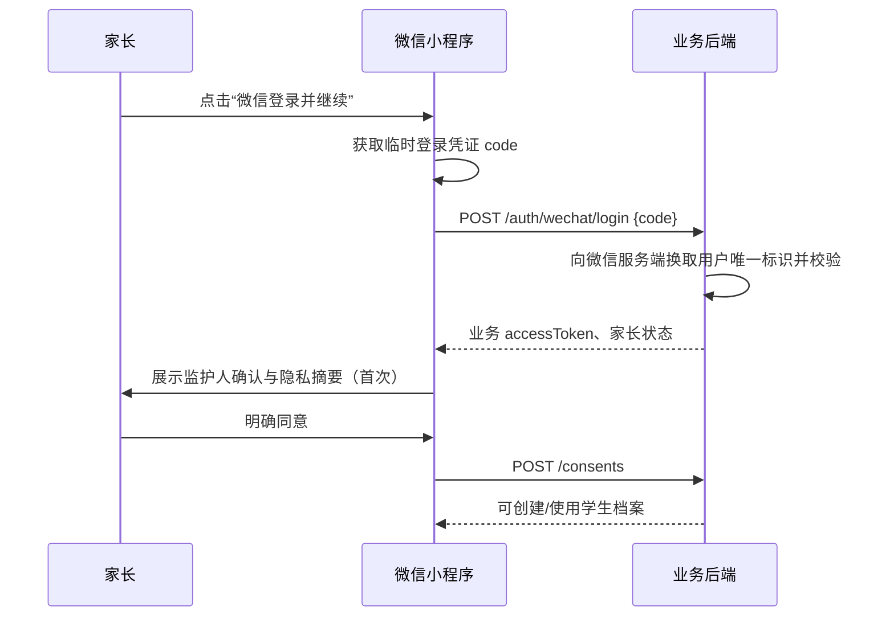

# PRD-002：家长作业讲解与错题本（微信小程序首发变更）

| 字段 | 内容 |
| --- | --- |
| 当前版本 | v1.1.0 |
| 创建日期 | 2026-07-13 |
| 状态 | 可开发 |
| 基线文档 | [PRD-002 v1.0.0](./PRD-002-parent-homework-mistakes-v1.0.0.md) |
| 变更性质 | 小程序首发的增量需求；未在本文修改的条目均沿用 v1.0.0 |

## 1. 决策

首发客户端调整为**微信小程序 + 独立后端 + OCR/AI 讲解服务**。不开发原生 iOS/Android App；原生 App 仅作为未来候选，不影响本期验收。

本次调整不改变产品核心闭环：家长/学生拍题 → 适龄讲解 → 保存错题 → 定期复习 → 家长查看学习报告。

## 2. 范围变更

| 项目 | v1.0.0 | v1.1.0 决定 |
| --- | --- | --- |
| 客户端 | iOS / Android App | 微信小程序首发 |
| 登录 | 手机号或合规第三方账号 | 微信授权登录为唯一账户入口；手机号为家长可选绑定项 |
| 拍题 | 原生相机/相册 | 小程序相机/相册能力；上传至独立后端 |
| 提醒 | App 推送 | 微信订阅消息 + 小程序内待复习卡片 |
| 后台任务 | 可能依赖原生推送 | 不依赖小程序后台常驻；后端定时任务判定待复习并尝试发送已获授权的订阅消息 |
| 学生使用 | 家庭设备或独立账号 | 首发仅“家庭设备模式”；不提供儿童独立微信账号登录 |

## 3. 小程序信息架构

底部 Tab 固定为 3 个：

| Tab | 页面 | 主要内容 | 主操作 |
| --- | --- | --- | --- |
| 首页 | `/pages/home/index` | 当前学生、今日待复习、最近错题、学习摘要 | 拍题、开始复习 |
| 错题本 | `/pages/mistakes/index` | 搜索、筛选、错题列表 | 查看、编辑、开始复习 |
| 我的 | `/pages/profile/index` | 学生管理、提醒、隐私、导出、删除 | 管理档案和授权 |

以下页面不出现在 Tab：登录与监护人同意、学生档案编辑、拍题、OCR 确认、讲解结果、错题详情、今日复习、学习报告、订阅提醒说明。

### 3.1 首页要求

1. 首次进入且无学生档案时，展示“创建孩子档案”唯一主按钮，不展示拍题和报告空壳。
2. 有档案时，首屏必须在不滚动的区域展示“讲解一道题”和“今日待复习”；下方展示最近错题和 7 日摘要。
3. 小程序重新打开时，恢复上次选中的学生档案；若该档案无权访问或已删除，则切换至第一个可访问档案或引导创建。
4. 不可通过分享卡片、页面参数或本地缓存绕过学生档案授权。

### 3.2 拍题与图片处理

1. 用户点击“讲解一道题”后选择“拍照”或“从相册选择”；不得在未点击时主动请求相机或相册权限。
2. 选择图片后进入本地预览页，支持裁剪、旋转、重新选择；默认提示“请只保留一道题，并遮挡姓名等信息”。
3. 客户端先调用后端取得一次性上传凭证，再直传图片对象存储；凭证仅允许当前用户、单对象、固定 MIME 类型和 10 分钟有效期。
4. 上传完成才创建题目记录。上传取消、失败或凭证过期时不创建空题目；可保留本地编辑草稿，用户再次确认后重传。
5. 小程序端不得将图片 Base64 长期存至本地缓存；题目原图只按 PRD-002 v1.0.0 的保存选择与删除规则留存于服务端。

### 3.3 讲解与复习页面

1. 讲解结果页保留“先想一想—解题思路—分步过程—最终答案”的默认折叠层级，首屏不可直接显示最终答案。
2. 同类练习的文字答案输入使用小程序安全键盘和长度限制；提交中禁用重复提交按钮。
3. 页面离开后，未提交的题干编辑和练习答案仅保留本地草稿；不上传为学习记录。
4. 分享能力仅允许分享小程序页面链接或产品介绍卡片；题目、讲解、错题详情、学习报告页面默认禁止对外分享，避免将儿童学习数据带出授权范围。

## 4. 微信登录、监护人授权与会话

### 4.1 登录流程

### 4.2 规则

1. 小程序 `code` 只能提交至业务后端，不得在前端保存或复用；后端使用服务端凭证换取用户标识。业务系统不得以客户端传入的 `openid` 作为身份依据。
2. 后端以内部 `ParentAccount.id` 作为全部业务资源主体；微信用户标识加密保存，严禁返回给客户端或写入日志。
3. 首次微信登录只建立待确认家长账户。未完成监护人确认前，只能查看产品介绍，不能创建档案、上传题目或请求讲解。
4. 手机号不是拍题/错题本使用的前置条件。若后续绑定手机号，必须由家长点击明确入口触发、说明用途、得到授权后再提交给后端；失败不影响核心使用。
5. 业务 access token 有效期 2 小时，刷新 token 有效期 30 天；用户退出、删除账户或检测到风险时立即失效。每次访问学生资源必须校验当前绑定关系。
6. 首发只允许家长微信身份登录。儿童在同一已登录设备/家庭设备模式中操作时，所有账户与隐私权利由已验证家长管理。

## 5. 订阅消息与复习提醒

### 5.1 定位

订阅消息是**可选提醒通道**，不是保证送达的任务系统。核心待复习状态必须始终在小程序首页和错题本内可见；没有订阅授权、模板不可用或消息发送失败均不得影响复习计划。

### 5.2 授权与发送规则

1. 家长在“我的 → 复习提醒”主动开启时，展示提醒内容、频率、数据用途和关闭方式，再发起订阅请求；不在首次登录、拍题或无关操作中强制索取订阅授权。
2. 提醒模板、类目、审核状态与可发送次数必须以微信平台当期规则和审核结果为准。开发实现不可假设一次授权可永久、无限次推送。
3. 后端每天按家长设定时间评估：存在到期错题、当天未完成任何复习、提醒开关开启、且该模板存在可用订阅资格时，最多发送 1 条。
4. 模板数据只包含学生昵称（如用户填写）、待复习题数和小程序内跳转路径；不得包含题干、答案、错因、成绩、真实姓名或其他敏感学习信息。
5. 发送失败、用户拒绝、模板失效或次数不足时，记录匿名化原因代码，不重试骚扰用户；首页仍显示待复习卡片。
6. 家长关闭提醒、撤回相关授权或删除学生档案后，后端立即停止该学生关联的后续提醒任务。

### 5.3 验收

- 未开启提醒的家长不会收到任何订阅消息；
- 开启后，即使后端任务重复执行，同一学生/自然日最多一条；
- 点击通知能打开正确学生的“今日复习”页面；无访问权限时落到首页并提示；
- 通知失败不会影响错题的 `nextReviewAt` 或复习统计。

## 6. 小程序与后端接口补充

| 方法 | 路径 | 认证 | 说明 |
| --- | --- | --- | --- |
| POST | `/api/v1/auth/wechat/login` | 无 | 使用小程序临时 `code` 创建/登录家长账户 |
| POST | `/api/v1/auth/wechat/refresh` | refresh token | 刷新业务会话 |
| POST | `/api/v1/uploads/credentials` | 家长业务 token | 申请单次图片直传凭证 |
| POST | `/api/v1/notification-subscriptions` | 家长业务 token | 保存经前端成功确认的订阅授权状态 |
| DELETE | `/api/v1/notification-subscriptions/{id}` | 家长业务 token | 关闭提醒并停止后续任务 |
| POST | `/api/v1/internal/reminders/review` | 服务间认证 | 仅定时任务调用，计算并发送当天提醒 |

`POST /auth/wechat/login` 不返回微信平台用户标识、服务端密钥、session key 或订阅模板凭证。上传凭证不得授权列举存储桶、读取其他对象或覆盖已有对象。

## 7. 工程、发布与合规要求

1. 小程序 AppID、服务端域名、上传域名和下载域名均使用生产/测试环境隔离配置；禁止将服务端密钥、AI 密钥、对象存储永久密钥或真实用户数据打包进小程序。
2. 上线前完成小程序主体、服务类目、隐私保护指引、用户隐私保护协议、订阅消息模板与必要接口权限的配置和审核；任何平台审核未通过的能力须以降级交互替代，不得绕过平台机制。
3. 小程序前端、后端和对象存储均按环境隔离；测试环境只能使用虚构儿童资料和测试图片。
4. 每次小程序启动、登录失效、网络断开、上传失败、订阅消息失败均有可理解的用户提示和可重试路径；不得展示底层错误、令牌或用户标识。
5. 兼容微信当前稳定基础库范围内的主流 iOS/Android 设备；具体最低基础库版本在技术方案中冻结并在发布前完成真机验证。

## 8. 变更后的验收场景

| 编号 | 场景 | 预期结果 |
| --- | --- | --- |
| MP-01 | 首次从微信进入小程序 | 微信登录后必须先完成监护人确认，才能创建学生档案 |
| MP-02 | 家长拒绝手机号授权 | 仍可创建档案、拍题、保存错题和复习 |
| MP-03 | 家长点击拍照后拒绝相机权限 | 显示开启权限指引和“从相册选择/文字输入”替代入口 |
| MP-04 | 图片直传凭证过期 | 上传失败且不创建题目；重新取得凭证后可继续 |
| MP-05 | 结果页分享 | 不向外分享题干或学生学习数据，只允许分享产品介绍 |
| MP-06 | 家长未开订阅提醒 | 仅首页显示待复习，不向微信发送消息 |
| MP-07 | 已开提醒且当天有 3 道待复习题 | 当日最多收到 1 条不含题干和答案的提醒，点击进入今日复习 |
| MP-08 | 同一提醒任务重复执行 | 不产生重复消息，复习统计不变 |
| MP-09 | 学生档案被解绑/删除后打开旧通知 | 不展示原学习数据，安全回落首页 |

## 9. 版本记录

| 版本 | 日期 | 变更 | 影响 |
| --- | --- | --- | --- |
| v1.0.0 | 2026-07-13 | 建立作业讲解、错题本和复习闭环的核心需求 | 基线 |
| v1.1.0 | 2026-07-13 | 确定微信小程序首发，补充小程序页面、微信登录、家庭设备模式、图片直传和订阅提醒要求 | 客户端、认证、提醒与发布方案变更 |

